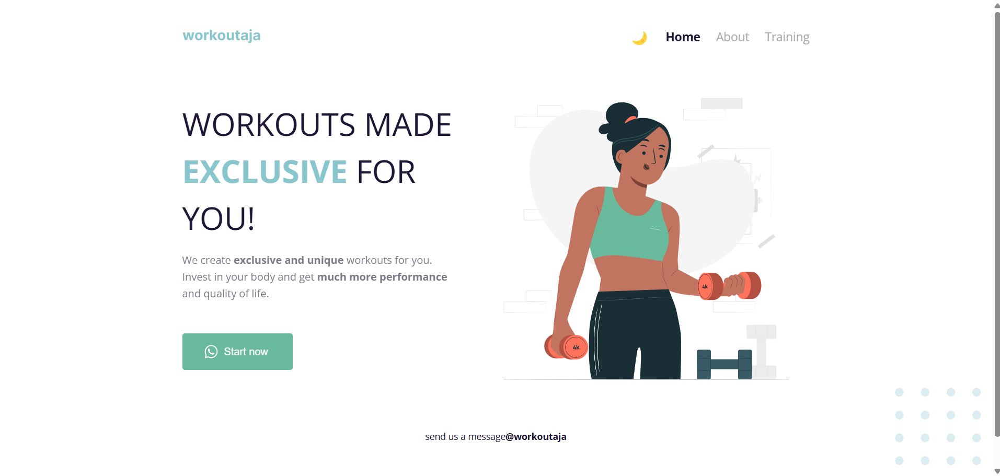
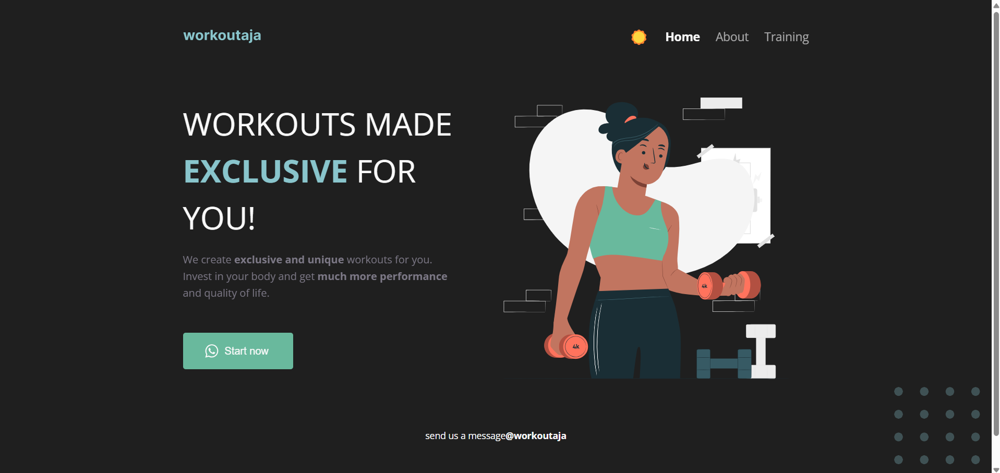

# Exercise 3 - CSS Styling Based on Figma Design

## Deskripsi Tugas

Tugas ini bertujuan untuk menyempurnakan styling CSS dari project web-client-development yang telah disediakan pada repo berikut:  
🔗 [GitHub Repo](https://github.com/cakrawala-university/web-client-development)

Desain akhir dari tampilan website mengacu pada link desain Figma berikut:  
🎨 [Figma Design](https://www.figma.com/design/CAawvDkcG4AloMWvHwrQvo/workoutaja?node-id=0-1&t=CfOlRclJPeT5PykW-1)

## Hasil Implementasi

Implementasi styling dilakukan berdasarkan elemen-elemen visual yang ditampilkan pada desain Figma, termasuk layout, warna, tipografi, tombol, dan dark/light mode.

Berikut ini hasil implementasi:

### ✅ Light Mode

### ✅ Dark Mode

## Fitur yang Diselesaikan

-   [✅] Penyesuaian warna dan tipografi berdasarkan desain Figma
-   [✅] Penambahan mode terang (light mode) dan gelap (dark mode)
-   [✅] Styling elemen utama seperti heading, subheading, tombol, dan navbar
-   [✅] Responsif di berbagai ukuran layar
-   [✅] Implementasi ikon pada tombol ("Start now")

## Tools dan Teknologi

-   HTML
-   CSS
-   JavaScript (jika diperlukan untuk toggle mode)
-   Figma sebagai referensi desain

## Catatan

-   Untuk pergantian mode light/dark dilakukan secara manual menggunakan toggle (jika ditambahkan).
-   Struktur HTML sudah disediakan dalam repositori GitHub, dan fokus utama adalah penyempurnaan style.
